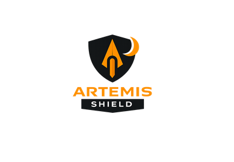

<p align="center">
  
</p>

# Project Artemis

Hello everyone,

Welcome to Project Artemis. This initiative was developed with significant AI assistance and remains very much a work in progress. With your collaboration and expertise, the goal is to build a practical, AI-centric EDR and cybersecurity solution designed specifically for small businesses, nonprofits, and organizations operating with limited budgets.

Project Artemis is not intended to replace a qualified cybersecurity team or a comprehensive security program. Instead, it is designed to serve as an accessible, supportive layer of protection, providing meaningful visibility, quality logging, and actionable information that can assist cybersecurity professionals when deeper analysis or intervention is required. Rather than relying on end users to describe what they believe they saw, Artemis aims to capture and present clear, structured data.

The long-term vision is to create a secure, locally running tool that performs foundational cybersecurity functions, offers basic remediation capabilities, and strengthens defensive posture in a responsible and controlled manner. This solution is meant for those who often go underserved like small charities, resource-constrained organizations, and even home users who need practical protection without enterprise-level budgets.

Our priorities are simplicity, reliability, and safety. The platform should be intuitive enough for non-technical users while still generating valuable technical insight. It should empower users to improve their security posture without overwhelming them or requiring significant financial investment in audits and remediation they may not fully understand.

Thank you for being part of this effort. I look forward to collaborating with you to build something meaningful, responsible, and impactful.

\- Jake

---

## What It Does

Artemis is an AI-assisted endpoint detection and response (EDR) platform that runs locally on your Windows machine. It monitors your system, detects threats, and provides clear explanations of what is happening and what to do about it.

Core capabilities:

- **Real-time endpoint monitoring** — process tracking, file integrity monitoring, Sysmon event ingestion
- **Vulnerability scanning** — 10 built-in scanners covering ports, SSL, SMB, default credentials, Windows configuration, password policy, audit policy, PowerShell policy, network shares, and autoruns
- **Threat correlation** — multi-event attack chain detection mapped to MITRE ATT&CK
- **AI-powered analysis** — natural language chat interface, investigation agent, plain-language alert narration
- **Security reporting** — automated HTML reports with findings, scores, and remediation steps
- **Adversary simulation** — 12 non-destructive MITRE ATT&CK techniques for testing your defenses
- **Remediation engine** — verified actions (kill process, quarantine file, block IP) with rollback support

The interface has two modes:

<p align="center">
  &nbsp;&nbsp;&nbsp;&nbsp;&nbsp;
  
</p>

- **Shield** — designed for non-technical users. Clean, simple, confidence-building. Shows your security score, protection status, and recent activity in plain language.
- **Archer** — designed for security professionals. Graphs, charts, live event feeds, hunt tools, correlation timelines, and full investigation capabilities.

## Requirements

- **Operating system:** Windows 10 or 11
- **Python:** 3.12 or 3.13 (not 3.14 — known compatibility issues)
- **Administrator privileges:** required for EDR monitoring (process tracking, Sysmon, file integrity)
- **Disk space:** approximately 100 MB for the application and dependencies
- **Optional:** Ollama with a local model (e.g., DeepSeek R1) for AI features. Artemis works without AI — all detection and scoring is deterministic. AI adds natural language explanations and investigation assistance.

## Installation

1. **Install Python 3.12 or 3.13**

   Download from https://www.python.org/downloads/ and make sure "Add Python to PATH" is checked during installation.

2. **Clone the repository**

   ```
   git clone https://github.com/ByteCreeper/project-artemis.git
   cd project-artemis
   ```

3. **Create a virtual environment**

   ```
   python -m venv .venv
   .venv\Scripts\activate
   ```

4. **Install dependencies**

   ```
   pip install -e .
   ```

   For development (testing, linting):

   ```
   pip install -e ".[dev]"
   ```

5. **Run Artemis**

   Open an **administrator** PowerShell or Command Prompt, activate the virtual environment, then:

   ```
   python run.py
   ```

   The dashboard will be available at http://127.0.0.1:8000

6. **Optional: Set up local AI**

   Install Ollama from https://ollama.com and pull a model:

   ```
   ollama pull deepseek-r1:70b
   ```

   Artemis will detect and use it automatically. If Ollama is not running, all features still work — AI enrichment is skipped gracefully.

## Configuration

### Quick Start

On first run, Artemis auto-generates an API token and saves it to `config/local.toml`. This token is required for all dashboard and API access. You will see it printed in the console output:

```
============================================================
FIRST RUN — API token generated
Token: <your-token-here>
Saved to: config/local.toml
Include in requests: Authorization: Bearer <your-token-here>
============================================================
```

Open http://127.0.0.1:8000/login in your browser and paste the token to log in. The token is also stored as a browser cookie so you stay logged in.

### Custom Configuration

The default configuration is in `config/default.toml`. To customize settings, copy it to `config/local.toml` and edit as needed. The local file overrides the defaults and is gitignored (never committed).

```
copy config\default.toml config\local.toml
```

Then edit `config/local.toml` with your settings.

### Network Setup

The most important setting to change is `network.scan_range`. Set this to YOUR local network:

```toml
[network]
scan_range = "192.168.1.0/24"    # Change to your network range
scan_interval_seconds = 60
```

To find your network range on Windows:
```
ipconfig
```
Look for your IPv4 address (e.g., `192.168.1.105`). If your IP is `192.168.1.x`, your range is likely `192.168.1.0/24`. If your IP is `10.0.0.x`, use `10.0.0.0/24`.

### AI Provider Setup

Artemis works without any AI provider. All detection, scoring, and remediation is fully deterministic. AI adds natural language explanations and investigation assistance.

**Option 1: Local AI with Ollama (recommended, free, private)**

Install Ollama from https://ollama.com, then pull a model:
```
ollama pull deepseek-r1:70b
```
Or for lower-resource machines:
```
ollama pull deepseek-r1:7b
```

No configuration needed — Artemis detects Ollama automatically at `http://localhost:11434`.

**Option 2: OpenAI API**

```toml
[ai]
provider = "openai"
model = "gpt-4o"
api_key = "sk-your-key-here"     # Get from https://platform.openai.com/api-keys
```

**Option 3: No AI**

```toml
[ai]
provider = "none"
```

All security features work identically. You just lose natural language explanations.

### Authentication

Authentication is enabled by default. On first run, a secure random token is generated and saved to `config/local.toml`. You can also set your own:

```toml
[web]
auth_enabled = true
api_key = "your-custom-token-here"
```

To disable authentication (not recommended for anything other than local testing):

```toml
[web]
auth_enabled = false
```

**API access** uses the same token via the `Authorization` header:

```
curl -H "Authorization: Bearer <your-token>" http://127.0.0.1:8000/api/health
```

### File Integrity Monitoring

By default, FIM watches `C:\Users` and `C:\Windows\System32`. You can customize:

```toml
[edr.file_integrity]
watch_paths = ["C:\\Users", "C:\\Windows\\System32", "C:\\Program Files"]
poll_interval_seconds = 30
```

### All Settings Reference

| Setting | Default | Description |
|---|---|---|
| `ai.provider` | `ollama` | AI backend: `ollama`, `openai`, or `none` |
| `ai.model` | `deepseek-r1:70b` | Model name for the selected provider |
| `ai.base_url` | `http://localhost:11434` | Ollama server URL (change if running remotely) |
| `ai.timeout_seconds` | `120` | Timeout for AI requests |
| `ai.api_key` | (empty) | API key for cloud AI providers (OpenAI, etc.) |
| `web.host` | `127.0.0.1` | Bind address (`0.0.0.0` to allow remote access) |
| `web.port` | `8000` | Port for the web dashboard |
| `web.auth_enabled` | `true` | Require token authentication |
| `edr.enabled` | `true` | Enable/disable all EDR monitoring |
| `edr.plugins` | `sysmon, process_monitor, file_integrity` | Which EDR plugins to enable |
| `edr.file_integrity.watch_paths` | `C:\Users, C:\Windows\System32` | Directories to monitor for file changes |
| `edr.file_integrity.poll_interval_seconds` | `30` | How often to check for file changes |
| `edr.sysmon_auto_install` | `false` | Auto-install Sysmon if not present |
| `network.enabled` | `true` | Enable network scanning |
| `network.scan_range` | `192.168.1.0/24` | Your local network range |
| `network.scan_interval_seconds` | `60` | How often to scan the network |
| `correlation.enabled` | `true` | Enable threat correlation |
| `correlation.window_seconds` | `300` | Time window for correlating related events |
| `correlation.min_chain_score` | `7.0` | Minimum score to trigger a correlated alert |
| `database.path` | `data/artemis.duckdb` | Path to the DuckDB database file |

### Environment Variables

All settings can be overridden with environment variables using the pattern `ARTEMIS_SECTION__KEY`:

```
set ARTEMIS_AI__PROVIDER=openai
set ARTEMIS_WEB__PORT=9000
set ARTEMIS_WEB__AUTH_ENABLED=false
set ARTEMIS_NETWORK__SCAN_RANGE=10.0.0.0/24
```

## Architecture

```
                     +------------------+
                     |    Web UI        |
                     |  (FastAPI/HTMX)  |
                     +--------+---------+
                              |
                     +--------v---------+
                     |    Event Bus     |
                     |    (async)       |
                     +---+----+----+---+
                         |    |    |
              +----------+    |    +----------+
              |               |               |
     +--------v-----+  +-----v------+  +-----v--------+
     |  EDR Plugins |  |  Network   |  |  Correlation  |
     |  - Sysmon    |  |  Scanner   |  |  Engine       |
     |  - Process   |  +------------+  +---------------+
     |  - FIM       |
     +--------------+        |
                             |
                    +--------v---------+
                    |    DuckDB        |
                    |  (embedded)      |
                    +------------------+
```

- **Event Bus** — all components communicate through typed async events
- **EDR Plugins** — modular, enable or disable per deployment (Sysmon, process monitor, file integrity)
- **Correlation Engine** — detects multi-event attack chains with MITRE ATT&CK mapping
- **AI Provider** — swappable (Ollama, OpenAI, or none). Degrades gracefully when unavailable
- **DuckDB** — embedded time-series storage. No external database server needed
- **Threat Classifier** — fully deterministic, evidence-based scoring. No AI guessing
- **Remediation Engine** — verified actions with pre-checks and rollback

## Project Structure

```
project-artemis/
  config/
    default.toml          Default configuration
  src/artemis/
    ai/
      chat.py             Natural language chat interface
      investigator.py     AI investigation agent
      alert_narrator.py   Plain-language alert translation
      provider.py         AI provider abstraction
    core/
      admin.py            Administrator privilege enforcement
      config.py           Configuration loader
      database.py         DuckDB connection management
      events.py           Event bus and event types
      persistence.py      Event storage
      remediation.py      Verified remediation actions
      threat_classifier.py  Deterministic threat scoring
    correlation/
      engine.py           Multi-event correlation with MITRE mapping
    edr/
      plugins/
        sysmon.py         Sysmon event ingestion
        process_monitor.py  Process tracking via psutil
        file_integrity.py   File integrity monitoring
    network/
      scanner.py          ARP-based network discovery
    redteam/
      simulator.py        Adversary simulation (12 techniques)
    reporting/
      generator.py        HTML security report generation
    scanner/
      base.py             Vulnerability scanner framework
      plugins.py          5 core scanner plugins
      config_audit.py     5 configuration audit plugins
    web/
      app.py              FastAPI application with lifespan
      pages.py            Page routes (Shield and Archer modes)
      api/routes.py       REST API endpoints
      templates/          Jinja2 HTML templates
      static/             CSS, images, client-side assets
  tests/
    test_p0.py            Core + chat + reporting tests (40 tests)
    test_p1.py            Scanner tests (29 tests)
    test_p2.py            Configuration audit tests (12 tests)
    test_p3.py            Adversary simulation tests (19 tests)
    test_p4.py            Alert narrator tests (17 tests)
  run.py                  Entry point
  pyproject.toml          Project metadata and dependencies
```

## Dependencies

All dependencies are listed in `pyproject.toml` and installed automatically with `pip install -e .`:

- **fastapi** and **uvicorn** — web server
- **jinja2** — HTML templating
- **duckdb** — embedded analytics database
- **httpx** and **ollama** — AI provider communication
- **psutil** — process monitoring
- **watchdog** — file system monitoring
- **scapy** — network scanning
- **pydantic** — data validation
- **pyyaml** — rule generation (Sigma/YARA format)
- **rich** — terminal output formatting
- **nats-py** — optional multi-process event bus (disabled by default)

## Running Tests

```
pip install -e ".[dev]"
pytest tests/test_p3.py tests/test_p4.py -v
python tests/test_p0.py
python tests/test_p1.py
python tests/test_p2.py
```

Test files P0, P1, and P2 are standalone runners. P3 and P4 use pytest directly.

## Current Status

Under active development. 117 tests passing across all modules.

What is working today:

- Bearer token authentication with auto-generated keys and login page
- All findings, investigations, scan results, alerts, and security scores persist to DuckDB across restarts
- Security score history tracked over time
- Core EDR monitoring (Sysmon, process tracking, file integrity)
- 10 vulnerability scanners operational
- 12 adversary simulation techniques (non-destructive, MITRE ATT&CK mapped)
- Threat correlation engine with MITRE mapping
- AI chat interface with 10 query intents
- AI investigation agent and plain-language alert narrator
- Automated HTML security report generation
- Shield (novice) and Archer (professional) dual-mode UI
- AI features work with Ollama or degrade gracefully without it

## Roadmap

Development is organized into six phases. Each phase builds on the previous one.

### Phase 1 — Foundation Hardening (complete)

- Bearer token authentication for all API and page routes, auto-generated on first run
- Login page with cookie-based sessions
- Findings, investigations, scan results, plain-language alerts, and security score history all persisted to DuckDB
- Data survives restarts. Score tracked every 15 minutes for trend analysis.

### Phase 2 — Detection Overhaul

The detection layer needs to be more precise and more extensible.

- **Externalized detection rules** — Move threat signatures and patterns from hardcoded Python into YAML rule files. Load at startup with hot-reload support. This allows updating detection capabilities without code changes and opens the door for community contributions.
- **Real-time file integrity monitoring** — Replace the current 30-second polling approach with real-time filesystem event watching. Monitor a curated list of critical files (hosts file, startup folders, scheduled tasks, system DLLs) instead of entire directory trees.
- **Learning mode for file integrity** — First week of operation builds a baseline silently. After that, alert on deviations from the established baseline rather than from a static snapshot.
- **Expanded Sysmon parsing** — Parse all 26+ Sysmon event types with proper field extraction, not just generic event ingestion.

### Phase 3 — Correlation Engine v2

The current correlation engine has three hardcoded rules. It needs to become a real analysis layer.

- **Session-based correlation** — Group events by Windows logon session, not just process ID. Processes, files, and network connections made in the same session are likely related.
- **Entity relationship graph** — Build a graph of relationships: process spawned child, process wrote file, process connected to IP, file was loaded by process. Look for suspicious paths through the graph.
- **Time-proximity scoring** — Events that happen closer together in time receive higher correlation scores.
- **YAML-based correlation rules** — Make correlation rules loadable and community-contributable, same as detection rules.
- **Tuning feedback loop** — When a user dismisses a finding, automatically increase the detection threshold for that pattern. The system learns from the user over time.

### Phase 4 — AI as Reasoning Engine

This is the pivot that makes Artemis genuinely AI-centric rather than AI-decorated.

- **Behavioral baselining** — Use the local LLM to learn what "normal" looks like for this specific machine over days and weeks. Normal processes, normal network patterns, normal file activity. The AI reasons about whether deviations are concerning given the full context.
- **Anomaly detection** — Flag deviations from the learned baseline. "This process has never run before" or "Network traffic to this IP started today" are more useful signals than static pattern matching alone.
- **Guided remediation conversations** — Instead of presenting buttons to kill processes or block IPs, the AI walks non-technical users through the decision: "I noticed something unusual. Here is what I see. Here is what I think it means. Here are your options. Would you like me to handle it?"
- **Triage and prioritization** — When multiple findings exist, the AI explains which ones actually matter, why, and in what order to address them. Context-aware prioritization, not just severity sorting.
- **Natural language rule creation** — Users can create custom detection rules in plain English: "Alert me when someone logs in after midnight" or "Notify me if a new program starts from the Downloads folder."

### Phase 5 — Shield Experience Overhaul

Shield mode needs to speak entirely in human language, not security metrics.

- **Plain statements instead of numbers** — "Nothing unusual happened today" instead of "247 events monitored." "A new device joined your network 20 minutes ago" instead of "Network Devices: 12."
- **Proactive notifications** — The system reaches out when something matters, not just when the user checks the dashboard.
- **Guided security checkup** — A wizard that walks users through improving their security score step by step, explaining each recommendation in plain language.
- **Activity timeline in human language** — The alert narrator becomes the primary Shield interface. Every event is a sentence, not a data point.
- **One-click actions** — "Block this," "Ignore this," "Tell me more" — simple choices for non-technical users.
- **Weekly digest** — Automated summary of the week: what happened, what changed, what improved.

### Phase 6 — Distribution and Community

- **One-click installer** — Windows installer via Inno Setup with all dependencies bundled.
- **Auto-update for detection rules** — Pull updated rule files from a central repository without requiring a full application update.
- **Community rule repository** — A place for users to share and contribute detection and correlation rules.
- **Documentation** — Setup guides, user guides, and contribution guides.
- **Cross-platform foundations** — Basic Linux support for broader reach.

## Contributing

This project is in early development. If you are interested in contributing, testing, or providing feedback, open an issue or reach out. Detection rules, scanner plugins, and correlation rules are the easiest places to start.

## License

MIT
